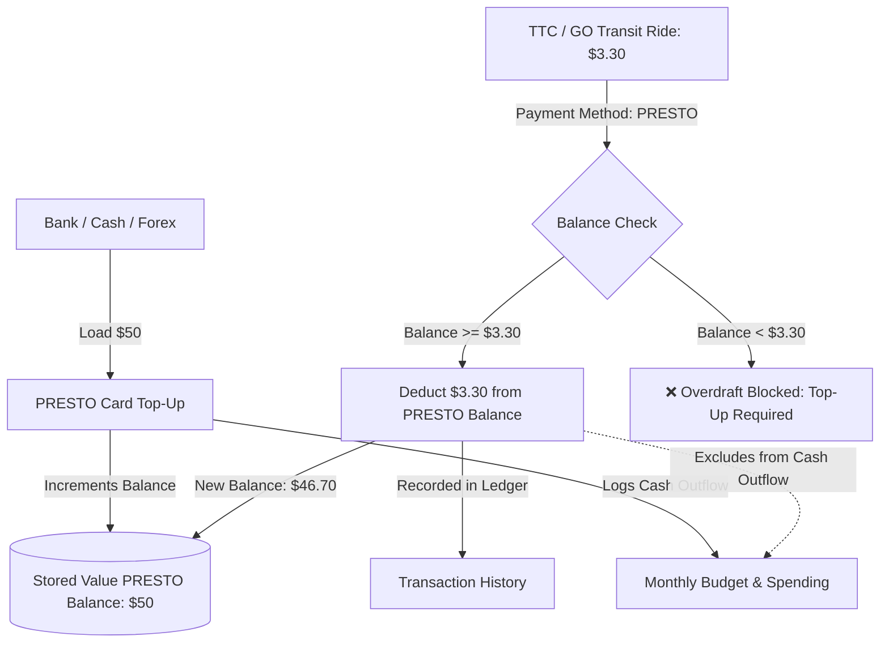

# 💳 Expense Tracker — Native iOS Student Fintech Application

[](https://developer.apple.com/swift/)
[](https://developer.apple.com/ios/)
[](https://developer.apple.com/xcode/swiftui/)
[](https://firebase.google.com/)
[](https://developer.apple.com/documentation/charts)

A production-grade, privacy-first personal finance and expense budgeting application engineered specifically for university and graduate students living independently in urban centers (such as Toronto, Canada). Built natively with **SwiftUI**, Apple's modern **Observation Framework** (`@Observable`), **Firebase Firestore**, and **Swift Charts**.

---

## 🌟 Architectural & Functional Highlights

### 1. 🚊 Stored-Value Transit (PRESTO) & Zero-Double-Counting Financial Engine
A fundamental challenge in personal expense tracking is handling **prepaid/stored-value transit cards** (e.g. PRESTO, Octopus, Oyster) without distorting cash outflows:
- **Card Top-Up:** Loading `$50` onto a PRESTO card is recorded as a direct cash outflow (under category `PRESTO`), updating monthly cash budget metrics and incrementing the local stored card balance.
- **Transit Rides / Taps:** Individual transit rides (e.g. `$3.30` on TTC or GO Transit) paid using the `PRESTO` payment method deduct directly from the live PRESTO card balance and log in the transaction ledger, **without double-counting against the monthly cash outflow budget**.
- **Real-Time Fare Estimator:** Dynamically calculates remaining transit rides based on standard regional transit fare algorithms ($3.30/tap).
- **Overdraft Protection:** The transaction engine evaluates live PRESTO balances and prevents logging a PRESTO payment if card funds are insufficient.



---

### 2. 📊 Advanced Visual Analytics Hub (`Swift Charts`)
Integrated directly into the app is a full analytical engine leveraging Apple's declarative **Swift Charts** framework:
- **🍩 Interactive Category Donut Chart (`SectorMark`):** Proportional distribution of monthly spending with interactive center-statistic callouts and ranked percentage breakdowns.
- **📈 Daily Spending Timeline (`BarMark` + `RuleMark`):** Day-by-day expense tracking overlaid with a dynamic **Daily Average pace line** to identify spending spikes.
- **📅 Day-of-Week Behavioral Heatmap:** Identifies high-spending days across weekdays and weekends.
- **🎓 Student Financial Insights Engine:**
  - *Coffee vs. Groceries Index:* Tracks discretionary cafe spending against essential supermarket expenditures.
  - *Daily Burn Rate & Runway:* Calculates real-time daily burn rate and projected month-end totals.
  - *Largest Single Outflow Tracker.*

---

### 3. 💳 Multi-Channel Payment & Currency Support
Designed for both domestic and international graduate students:
- **Payment Methods:** `Credit`, `Debit`, `Forex Card` (Foreign Exchange travel card), `Cash`, `E-Transfer`, and `PRESTO`.
- **Mandatory Constraint Enforcement:** All transactions strictly enforce 5-point data integrity (`Amount`, `Category`, `Merchant/Payee`, `Date`, `Payment Method`) prior to persistence.
- **Contextual Merchant Autocomplete:** Category-aware quick chips dynamically suggest regional merchants (e.g., *Tim Hortons, Starbucks, Metro, Loblaws, TTC, UofT Bookstore, Rogers, Bell*).

---

## 🏛️ Architecture & Design Patterns

The application is structured following the modern **Model-View-ViewModel (MVVM)** design pattern with `@Observable` macro state management, structured concurrency (`async/await`), and deterministic cloud persistence.

```mermaid
graph LR
    subgraph UI Layer [SwiftUI Views]
        DashboardView[DashboardView\nHome & PRESTO Widget]
        TransactionView[TransactionListView\nFull Ledger & Search]
        AddExpenseView[AddExpenseView\nDynamic Form & Haptics]
        BudgetView[BudgetOverviewView\nCharts & Targets]
        SettingsView[CategoryManagementView\nCustom CRUD]
    end

    subgraph ViewModel Layer [Observable ViewModels]
        DVM[DashboardViewModel]
        TVM[TransactionViewModel]
        EVM[ExpenseViewModel]
        BVM[BudgetViewModel]
        AVM[AnalyticsViewModel]
    end

    subgraph Service Layer [Services]
        AuthService[AuthService\nFirebase Auth]
        FirestoreService[FirestoreService\nFirestore CRUD & Metrics]
    end

    subgraph Backend Layer [Cloud Infrastructure]
        FirebaseAuth[(Firebase Authentication)]
        CloudFirestore[(Cloud Firestore NoSQL)]
    end

    UI Layer --> ViewModel Layer
    ViewModel Layer --> Service Layer
    Service Layer --> Backend Layer
```

---

## 📂 Project Directory Structure

```
Expense Tracker/
├── Models/
│   ├── Expense.swift              # Core expense entity with safe Codable decoding
│   ├── ExpenseCategory.swift      # Category model with SF Symbols & hex colors
│   ├── Budget.swift               # Monthly spending limits & category allocations
│   ├── UserProfile.swift          # User metadata and preferences
│   └── AnyCodableValue.swift      # Polymorphic custom field encoder
├── ViewModels/
│   ├── DashboardViewModel.swift   # Home screen orchestration & PRESTO metrics
│   ├── ExpenseViewModel.swift     # Form validation, balance checks & haptics
│   ├── TransactionViewModel.swift # Search, filtering & swipe-to-delete
│   ├── BudgetViewModel.swift      # Category budget allocations & progress
│   ├── AnalyticsViewModel.swift   # Swift Charts time-series & insight engines
│   ├── AuthViewModel.swift        # Authentication state flow
│   └── SettingsViewModel.swift    # Category management & data controls
├── Views/
│   ├── Dashboard/
│   │   ├── DashboardView.swift    # Hero spend card, metallic PRESTO widget & pacing
│   │   └── PrestoTopUpSheet.swift # 1-tap rapid top-up modal with preset chips
│   ├── Expenses/
│   │   └── AddExpenseView.swift   # Adaptive keypad & mandatory field validation
│   ├── Transactions/
│   │   └── TransactionListView.swift # Date-grouped transaction ledger & search
│   ├── Budgets/
│   │   └── BudgetOverviewView.swift  # Swift Charts analytics & budget target hub
│   ├── Settings/
│   │   ├── SettingsView.swift
│   │   └── CategoryManagementView.swift # Full Category CRUD & auto-seeder
│   └── Components/
│       ├── ProgressRing.swift     # Smooth animated circular progress ring
│       └── PrivacyOverlayView.swift
├── Services/
│   ├── AuthService.swift          # Anonymous & Email Firebase authentication
│   └── FirestoreService.swift     # Isolated subcollections & stored-value aggregation
├── Utilities/
│   ├── Constants.swift            # 12 default student categories & suggestions
│   ├── CurrencyFormatter.swift    # Locale-safe currency & decimal formatting
│   └── DateHelpers.swift          # Month-year grouping & calendar helpers
├── firestore.rules                # Strict user-isolated security rules
└── Expense_TrackerApp.swift       # App lifecycle & AppDelegate Firebase initialization
```

---

## 🔒 Security & Data Isolation

Data access is strictly gated at the database layer via **Cloud Firestore Security Rules**:
- Every document is stored within a private subcollection under `users/{userId}/...`.
- Client requests are authorized only when `request.auth.uid == userId`, preventing data cross-talk or unauthorized multi-tenant queries.

```javascript
rules_version = '2';
service cloud.firestore {
  match /databases/{database}/documents {
    match /users/{userId}/{document=**} {
      allow read, write: if request.auth != null && request.auth.uid == userId;
    }
  }
}
```

---

## 🚀 Getting Started & Building Locally

### Prerequisites
- **macOS** Sonoma (14.0+) or Sequoia (15.0+)
- **Xcode** 16.0+ (iOS 18.0+ SDK)
- Active **Apple Developer Account** or Simulator

### Setup Instructions
1. **Clone the Repository:**
   ```bash
   git clone https://github.com/amEya911/Expense-Tracker.git
   cd Expense-Tracker
   ```

2. **Open in Xcode:**
   ```bash
   open "Expense Tracker.xcodeproj"
   ```

3. **Firebase Configuration:**
   - The project includes a pre-configured `GoogleService-Info.plist` attached to the main app bundle target.

4. **Build and Run:**
   - Select an iOS Simulator (e.g. iPhone 16 Pro) or a connected physical device.
   - Press **⌘R** to build and launch.

---

## 👨‍💻 Author
- **Ameya Kulkarni**
- GitHub: [@amEya911](https://github.com/amEya911)
